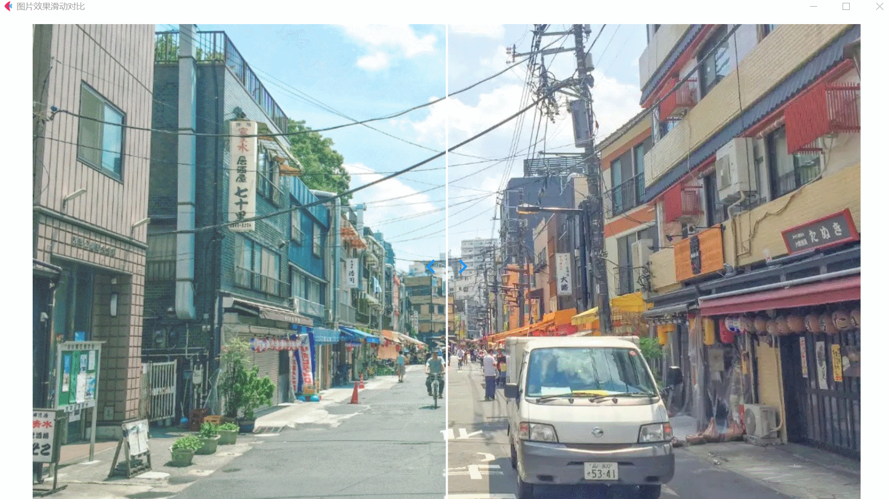

### 用 Python + Flet 实现两张堆叠图片，拖动滑动线查看对比效果

flet version：0.85.3


### 效果

## 原图片

<p align="left">
  
  &nbsp;&nbsp;&nbsp;&nbsp;&nbsp;&nbsp;&nbsp;&nbsp;&nbsp;&nbsp;&nbsp;&nbsp;&nbsp;&nbsp;&nbsp;&nbsp;
  
</p>

<br/>




### 使用方法

### 1. 安装 flet
```commandline
    pip install "flet[all]"
```

### 2. 运行
```commandline
    flet run main.py
```
或者 

直接在 pycharm 中运行 main.py 文件

### 其他

用鼠标控制滑动线，查看两张图片的对比效果
